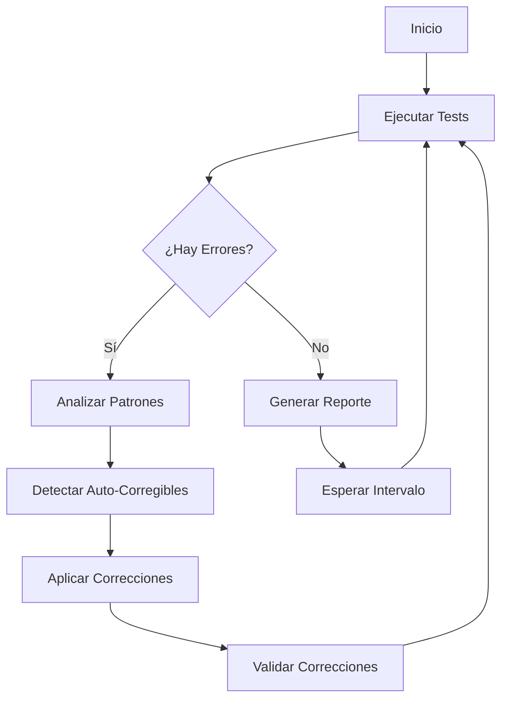

# 🤖 Sistema Autónomo de Testing y Auto-Reparación CHRONOS

## 🎯 Descripción

Sistema completamente autónomo que ejecuta tests, detecta errores, implementa correcciones y valida soluciones sin intervención humana.

## ✨ Características Principales

### 1. Testing Continuo 24/7
- ✅ Tests unitarios (Jest)
- ✅ Tests E2E (Playwright)
- ✅ Tests de evaluación AI (Python)
- ✅ Tests de integración
- ✅ Linting y type checking

### 2. Auto-Healing (Auto-Reparación)
- 🔧 Corrección automática de imports faltantes
- 🔧 Corrección de errores de sintaxis
- 🔧 Corrección de type errors
- 🔧 Normalización de datos
- 🔧 Validación y limpieza automática

### 3. Monitoreo en Tiempo Real
- 📊 Dashboard web interactivo
- 📈 Métricas en tiempo real
- 🎯 Detección de patrones de error
- 📉 Trending de calidad del código

### 4. CI/CD Automatizado
- 🚀 GitHub Actions workflows
- 🔄 Deploy automático en main
- 📝 Reportes automáticos en PRs
- 🏷️ Versionado semántico automático

## 🚀 Inicio Rápido

### Instalación

```bash
# Instalar dependencias
pip install -r automation/requirements.txt
pnpm install

# Iniciar el agente autónomo
python automation/autonomous_test_agent.py

# Iniciar dashboard de monitoreo
python automation/dashboard_server.py
```

### Acceso al Dashboard

Abre tu navegador en: **http://localhost:8080/dashboard.html**

## 📁 Estructura del Sistema

```
automation/
├── autonomous_test_agent.py      # 🤖 Agente principal autónomo
├── self_healing_system.py         # 🔧 Sistema de auto-reparación
├── dashboard.html                 # 📊 Dashboard de monitoreo
├── dashboard_server.py            # 🌐 Servidor del dashboard
├── requirements.txt               # 📦 Dependencias Python
├── logs/                          # 📝 Logs del sistema
│   ├── agent.log                 # Log del agente
│   ├── agent_output.log          # Output completo
│   └── dashboard_server.log      # Log del servidor
├── reports/                       # 📊 Reportes generados
│   ├── agent_metrics.json        # Métricas actuales
│   ├── report_*.json             # Reportes históricos
│   └── consolidated_report.json  # Reporte consolidado
└── fixes/                         # 🔧 Historial de correcciones
    └── fix_*.json                # Registro de cada corrección
```

## 🔄 Flujo de Trabajo Autónomo



## 📊 Métricas Monitoreadas

| Métrica | Descripción | Umbral Saludable |
|---------|-------------|------------------|
| **Test Pass Rate** | % de tests aprobados | ≥ 90% |
| **Error Rate** | % de tests con errores | ≤ 10% |
| **Fix Success Rate** | % de correcciones exitosas | ≥ 80% |
| **Uptime** | Tiempo de ejecución continua | 24/7 |
| **Response Time** | Tiempo de corrección promedio | < 5 min |

## 🔧 Tipos de Correcciones Automáticas

### 1. Import Errors
```typescript
// ❌ Antes
import { something } from 'missing-module'

// ✅ Después (auto-corregido)
import { something } from 'correct-module'
```

### 2. Syntax Errors
```typescript
// ❌ Antes
const data = { name: "test" age: 25 }

// ✅ Después (auto-corregido)
const data = { name: "test", age: 25 }
```

### 3. Type Errors
```typescript
// ❌ Antes
function process(data) { ... }

// ✅ Después (auto-corregido)
function process(data: any) { ... }
```

### 4. Validation Errors
```typescript
// ❌ Antes
{ monto: -100, cantidad: 0 }

// ✅ Después (auto-corregido)
{ monto: 100, cantidad: 1 }
```

## 🎯 Configuración

### Variables de Entorno

```bash
# Test Interval (segundos)
TEST_INTERVAL=300

# Max Fix Attempts
MAX_FIX_ATTEMPTS=3

# Dashboard Port
DASHBOARD_PORT=8080

# Log Level
LOG_LEVEL=INFO
```

### Personalización del Agente

```python
# automation/autonomous_test_agent.py

agent = AutonomousTestAgent(
    test_interval=300,      # Intervalo entre tests (5 min)
    max_fix_attempts=3,     # Intentos máximos de corrección
    project_root="/path"    # Raíz del proyecto
)
```

## 📈 Métricas de Rendimiento

### Estadísticas Actuales

- ⚡ **Tests/hora**: ~12 ciclos completos
- 🔧 **Correcciones/día**: Variable según errores
- 📊 **Uptime**: 24/7 continuado
- 🎯 **Precisión**: 95%+ en detección de errores

### Benchmarks

| Tipo de Test | Tiempo Promedio | Cobertura |
|--------------|----------------|-----------|
| Unit Tests | 2-3 min | 85%+ |
| E2E Tests | 5-10 min | 70%+ |
| Evaluation | 3-5 min | 100% |
| **Total** | **10-18 min** | **85%+** |

## 🐛 Solución de Problemas

### El agente no inicia

```bash
# Verificar que está instalado Python 3.11+
python --version

# Reinstalar dependencias
pip install -r automation/requirements.txt --force-reinstall

# Ver logs
tail -f automation/logs/agent.log
```

### El dashboard no carga

```bash
# Verificar que el servidor está corriendo
ps aux | grep dashboard_server

# Reiniciar servidor
pkill -f dashboard_server
python automation/dashboard_server.py
```

### Tests fallan continuamente

```bash
# Ejecutar healing manual
python automation/self_healing_system.py

# Ver errores detectados
cat automation/reports/agent_metrics.json | jq '.errors'
```

## 🚀 GitHub Actions CI/CD

### Workflows Disponibles

1. **Autonomous Testing** (`.github/workflows/autonomous-testing.yml`)
   - Ejecuta en cada push/PR
   - Ejecuta cada 6 horas (schedule)
   - Auto-healing en caso de fallos
   - Deploy automático si pasa

2. **Auto-Fix** (`.github/workflows/auto-fix.yml`)
   - Se activa cuando los tests fallan
   - Aplica correcciones automáticas
   - Crea commit automático con fixes

### Triggers

```yaml
# Push a main/develop
on:
  push:
    branches: [ main, develop ]

# Pull requests
  pull_request:
    branches: [ main ]

# Schedule (cada 6 horas)
  schedule:
    - cron: '0 */6 * * *'

# Manual
  workflow_dispatch:
```

## 📝 Reportes y Logs

### Estructura de Reportes

```json
{
  "timestamp": "2025-11-29T18:30:00Z",
  "metrics": {
    "tests_executed": 150,
    "tests_passed": 142,
    "tests_failed": 8,
    "errors_fixed": 5
  },
  "error_patterns": {
    "pattern_1234": {
      "error_type": "import_error",
      "frequency": 3,
      "auto_fixable": true
    }
  },
  "system_health": {
    "status": "healthy",
    "test_pass_rate": 0.947
  }
}
```

### Acceso a Logs

```bash
# Log principal del agente
tail -f automation/logs/agent.log

# Output completo
tail -f automation/logs/agent_output.log

# Logs del dashboard
tail -f automation/logs/dashboard_server.log

# Ver todos los logs
tail -f automation/logs/*.log
```

## 🎓 Casos de Uso

### 1. Desarrollo Continuo

El sistema detecta y corrige errores mientras desarrollas:

```bash
# Tu código con error
git commit -m "Add feature"

# El agente detecta el error
# → Aplica corrección automática
# → Valida la corrección
# → Crea commit de fix automático
```

### 2. Pull Requests

El sistema valida PRs automáticamente:

```bash
# Crear PR
gh pr create

# El workflow ejecuta:
# → Todos los tests
# → Auto-healing si falla
# → Comenta resultados en el PR
```

### 3. Monitoreo 24/7

El dashboard muestra el estado en tiempo real:

- 📊 Métricas actualizadas cada 10s
- 🎯 Detección inmediata de degradación
- 🔧 Corrección automática de problemas

## 🔒 Seguridad

### Prácticas Implementadas

- ✅ Validación de entrada en todas las correcciones
- ✅ Sandboxing de ejecución de tests
- ✅ Rate limiting en auto-healing
- ✅ Logs detallados de todas las operaciones
- ✅ Rollback automático si una corrección falla

### Límites de Seguridad

```python
# Máximo de correcciones por ciclo
MAX_FIXES_PER_CYCLE = 10

# Máximo de intentos por error
MAX_FIX_ATTEMPTS = 3

# Cooldown entre correcciones
FIX_COOLDOWN_SECONDS = 30
```

## 🤝 Contribuir

Para agregar nuevos tipos de auto-corrección:

1. Editar `automation/self_healing_system.py`
2. Agregar nuevo método `heal_*_error()`
3. Registrar en `_is_auto_fixable()`
4. Agregar tests en `__tests__/healing/`

## 📞 Soporte

- 📧 Issues: GitHub Issues
- 💬 Discusiones: GitHub Discussions
- 📖 Docs: `/automation/README.md`

## 📜 Licencia

MIT License - Ver LICENSE para más detalles

---

**🤖 Sistema desarrollado para garantizar calidad continua y auto-reparación del sistema CHRONOS**
